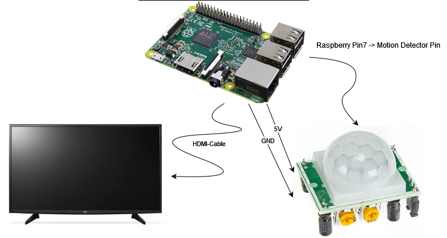

# Hi there, this is RasViewTV!
Who the hell thought of that name??

# What is it?
RasViewTV is a tiny Python3 Script that runs on a Raspberry Pi, uses a cheap motion sensor and connects to a standard TV. Depending on the motion detection of the sensor it turns the connected TV on or off.

# Why is it?
Once upon a time I got my hand on a free TV and decided it would be a great idea to have it display some financial data 24/7 in my apartment. Even though the electricity prices were still cheap back in those days I decided to only activate the TV when someone is actually around to see.

# How is it?
The Raspberry Pi uses the HDMI CEC Protocol over the HDMI-Cable to control the TV. 

# How can I use this in my project?
Just do it! (Please insert Shia LaBeouf Meme)
Hardware you need:
- Raspberry PI (Just use one that supports HDMI-CEC)
- Some OS on the PI (I used Raspbian (Not sure of the Version))
- TV that supports HDMI-CEC (I think most do) --> Monitors do NOT support it!
- Cheap motion sensor/detector from AliExpress/Amazon/Side of the Street.
- Some cables to connect all of that.

Software you need:
- Some Python 3 (Just use a recent version)
- Install cec-utils on os (sudo apt install cec-utils)
- Os needs to be installed for Python

You are ready to rock!

# Declaration
That's a one evening script I just used for a very short time. Just updating it now to have better documentation, because some people asked for it. I don't know if everything is still functional.
